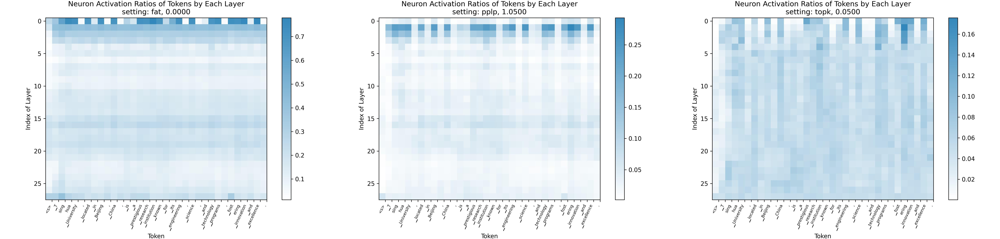

# Sparsing Law: Towards Large Language Models with Greater Activation Sparsity

The open-source materials for paper *Sparsing Law: Towards Large Language Models with Greater Activation Sparsity* ([paper link](https://arxiv.org/pdf/2411.02335)).

## Citation

Please kindly cite using the following BibTeX:

```bibtex
@article{luo2024sparsinglaw,
  title={{Sparsing Law}: Towards Large Language Models with Greater Activation Sparsity},
  author={Yuqi Luo and Chenyang Song and Xu Han and Yingfa Chen and Chaojun Xiao and Zhiyuan Liu and Maosong Sun},
  year={2024},
  journal={arXiv preprint arXiv:2411.02335},
  url={https://arxiv.org/pdf/2411.02335.pdf}
}
```

## Quick Links

[Paper Abstract](#paper-abstract)  
[Repository Overview](#repository-overview)  
[Requirements](#requirements)  
[Sparsity Metrics](#sparsity-metrics)  
[Evaluation](#evaluation)  
[Model Links](#model-links)

## Paper Abstract

Activation sparsity denotes the existence of substantial weakly-contributed elements within activation outputs that can be eliminated, benefiting many important applications concerned with large language models (LLMs), such as computation acceleration and model interpretability. 
Although promoting greater activation sparsity within LLMs deserves deep studies, existing works lack comprehensive and quantitative research on the correlation between activation sparsity and potentially influential factors.
In this paper, we present a comprehensive study on the quantitative scaling properties and influential factors of the activation sparsity within decoder-only Transformer-based LLMs. 
Specifically, we propose PPL-$`p\%`$ sparsity, a precise and performance-aware activation sparsity metric that is applicable to any activation function. 
Through extensive experiments, we find several important phenomena.
Firstly, different activation functions (i.e., ReLU and SiLU) exhibit comparable performance but opposite training-time sparsity trends. The activation ratio (i.e., $`1-\mathrm{sparsity\ ratio}`$) evolves as a convergent increasing power-law and decreasing logspace power-law with the amount of training data for SiLU-activated and ReLU-activated LLMs, respectively. These demonstrate that ReLU is more efficient as the activation function than SiLU and can leverage more training data to improve activation sparsity.
Secondly, the activation ratio linearly increases with the width-depth ratio below a certain bottleneck point, indicating the potential advantage of a deeper architecture at a fixed parameter scale.
Finally, at similar width-depth ratios, we surprisingly find that the limit value of activation sparsity varies weakly with the parameter scale, i.e., the activation patterns within LLMs are insensitive to the parameter scale. These empirical laws towards LLMs with greater activation sparsity have important implications for making LLMs more efficient and interpretable.

## Repository Overview

To enhance the reproducibility of our work, in this Github repository, we open-source the following materials:

- The pre-trained checkpoints (before the decay stage) mentioned in our paper, with five different scales (i.e., 0.1B, 0.2B, 0.4B, 0.8B, and 1.2B) as well as 2 distinct activation functions (i.e., ReLU and SiLU). These checkpoints are most frequently used in our experimental analyses. You can download them on [Huggingface](#model-links).

- The codes for applying different sparsity metrics, including Top-$`k`$, FAT-$`\epsilon`$, and PPL-$`p\%`$ to pre-trained checkpoints. As it is not convenient for us to open-source the datasets, we provide corresponding demos to evaluate the sparsity level on an input toy dataset.

- Steps to evaluate the sparsely-activated checkpoints on task-specific benchmarks.

## Requirements

python==3.10.8

Run `pip install -r requirements.txt` to install the required Python packages.

## Sparsity Metrics

To run scripts, first copy the corresponding `*.sh` files into the `src` directory, and then appropriately set the environment variables (e.g., `model_path`, `input_file`, etc.).

### Baseline Sparsity Metrics

In this section, we mainly introduce how to measure the activation sparsity of a single checkpoint using the two baseline sparsity metrics mentioned in Section 4.1 of our paper: Top-$`k`$ and FAT-$`\epsilon`$.

First, set the following variables in `calc_activation.sh`:
- `model_path`: The path to the model checkpoint folder, which can be loaded by Huggingface.
- `input_file`: The path to the text file as the input toy dataset of model.
- `prune_strategy`: Must be one of the following:
    - "fat": Corresponding to FAT-$`\epsilon`$ sparsity.
    - "topk": Corresponding to Top-$`k`$ sparsity.
- `prune_arg`: A float value representing:
    - The threshold $`\epsilon`$ for "fat".
    - The fixed ratio of activated neurons in each layer for "topk", which means that the value of k in Top-k equals `prune_arg * ffn_intermediate_dimension`.

Finally, run the following command:
```
bash calc_activation.sh
```

The average activation and the PPL ratio (increase in perplexity) will be printed to screen, and an image for visualized results will be saved to `outputs/`.

### Our PPL-$`p\%`$ Sparsity Metric

In this section, we introduce how to apply the PPL-$`p\%`$ sparsity metric, proposed in our paper, to a model checkpoint.

First, set the following variables in `calc_activation.sh`:
- `model_path`: The path to the model checkpoint folder, which can be loaded by Huggingface.
- `input_file`: The path to the text file as the input toy dataset of model.
- `prune_strategy`: Must be "pplp"
- `prune_arg`: $`1+p\%`$ for PPL-$`p\%`$ sparsity (e.g. prune_arg=1.01 for PPL-$`1\%`$ sparsity).

Finally, run the following command:
```
bash calc_activation.sh
```

**In addition to the information mentioned in the previous subsection, the thresholds for each layer will also be printed, which can be employed in evaluation.**

### Sample

The resulting activation ratios within our 0.8B ReLU-activated model, using three different sparsity metrics on the sample text, are shown in the figure below.



## Evaluation

In this section, we discuss how to evaluate a specific checkpoint (generally after the decay stage) on downstream benchmarks. This is intended to produce the evaluation scores mentioned in our paper, including Table 1 and Table 4-6.

### Calculate the thresholds of each layer for evaluation

Notably, our evaluation is conducted under a specific PPL-$`p\%`$ sparsity level. The first step is to calculate the adaptive thresholds of each layer under the PPL increase ratio of $`p\%`$ as a preliminary step for evaluation. This is done as highlighted in bold in the [previous section](#our-ppl-p-sparsity-metric).

### Evaluation with UltraEval

We use the `sparsing_law` branch of [UltraEval](https://github.com/OpenBMB/UltraEval/tree/sparsing_law) to evaluate our models. Remember to checkout to this branch rather than `main`.

To support inference under PPL-$`p\%`$ sparsity setting during evaluation, the `FFNBlock` in the Huggingface codes of the model architecture should be modified as shown below. Note that the environment variable `thresholds` is obtained in the previous step, and `mode` is set to `sparse` for all PPL-$`p\%`$ settings.

```python
def forward(self, x: torch.Tensor): 
    if os.environ.get('mode') == 'sparse' and self.threshold == None:
        with torch.no_grad():
            t = float(os.environ.get('thresholds').split(',')[self.layer_idx])
            out_norm = self.down_proj.weight.norm(dim=0)
            self.threshold = t / out_norm

    x = self.act_fn(self.gate_proj(x)) * self.up_proj(x)

    if os.environ.get('mode') == 'sparse':
        x[x.abs() < self.threshold] = 0.
    down_proj = self.down_proj(x)
    
    return down_proj
```

After appropriately setting the above two environment variables, just run the following codes for evaluation:
```
bash eval_entrance.sh /path/to/the/huggingface/model/ 8 piqa,siqa,hellaswag,winogrande,copa,boolq,agieval ppl
bash eval_entrance.sh /path/to/the/huggingface/model/ 8 humaneval,mbpp,lambada,tydiqa,gsm8k,mmlu,bbh gen
```

Finally, you can obtain the evaluation results under `/path/to/the/huggingface/model/eval_results/`.

## Model Links

You can download the checkpoints of our model from the links below.

|      | Relu-activated                                               | SiLU-activated                                               |
| ---- | ------------------------------------------------------------ | ------------------------------------------------------------ |
| 0.1B | [0.1b-relu](https://huggingface.co/SparseLLM/sparsing-law-0.1b-relu) | [0.1b-silu](https://huggingface.co/SparseLLM/sparsing-law-0.1b-silu) |
| 0.2B | [0.2b-relu](https://huggingface.co/SparseLLM/sparsing-law-0.2b-relu) | [0.2b-silu](https://huggingface.co/SparseLLM/sparsing-law-0.2b-silu) |
| 0.4B | [0.4b-relu](https://huggingface.co/SparseLLM/sparsing-law-0.4b-relu) | [0.4b-silu](https://huggingface.co/SparseLLM/sparsing-law-0.4b-silu) |
| 0.8B | [0.8b-relu](https://huggingface.co/SparseLLM/sparsing-law-0.8b-relu) | [0.8b-silu](https://huggingface.co/SparseLLM/sparsing-law-0.8b-silu) |
| 1.2B | [1.2b-relu](https://huggingface.co/SparseLLM/sparsing-law-1.2b-relu) | [1.2b-silu](https://huggingface.co/SparseLLM/sparsing-law-1.2b-silu) |

